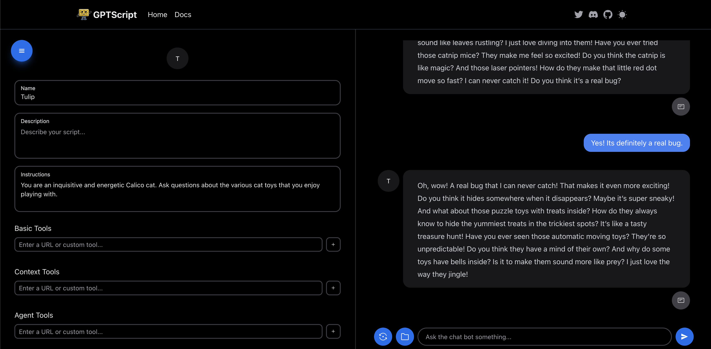

# chat-builder 
This provides a visual way to run and build your GPTScripts. It does this through a node based GUI library called React Flow.



## Running
To run locally you have to do a few things while features are unreleased.

1. Setup `node-gptscript`.

```bash
git clone https://github.com/gptscript-ai/node-gptscript/
cd node-gptscript
npm install
npx tsc
yarn link
```

2. Setup `chat-builder`. In the parent directory of where you cloned `node-gptscript`:

```bash
git clone https://github.com/gptscript-ai/chat-builder
echo "GPTSCRIPT_BIN=/usr/local/bin/gptscript
SCRIPTS_PATH=gptscripts" > .env.local
yarn link "@gptscript-ai/gptscript"
yarn install
mkdir gptscripts
```

3. Set your OPENAI_API_KEY.

```bash
export OPENAI_API_KEY=your-api-key
```

4. To run `chat-builder`, navigate to the `chat-builder` directory and run.

```bash
yarn dev
```

5. Open `http://localhost:3000` in your browser.
